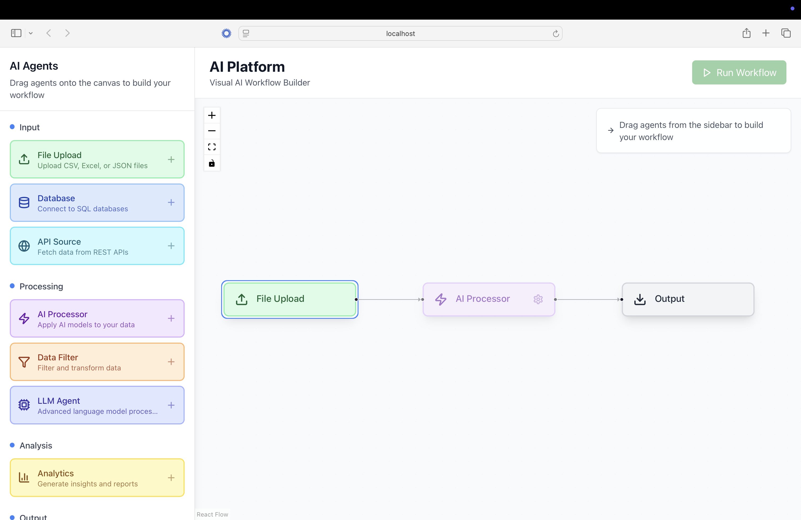
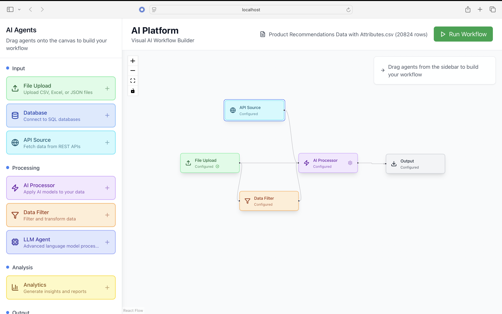

# 🔧 N8N-Style AI Workflow Platform

This project is a low-code, modular AI workflow builder inspired by [n8n.io](https://n8n.io), built using **React** (frontend) and **Python** (backend).

It allows internal teams to visually connect AI agents (like CSV processors, embedding generators, and LLM-based enrichers) into workflows.

### 🔹 Landing Page


### 🔹 Drag-and-Drop Agent Flow


---

## 📁 Folder Structure

```
root/
├── backend/      # FastAPI backend with LangGraph agents
├── frontend/     # React frontend with drag-and-drop canvas
```


---

## 🧩 Tech Stack

- 🔵 **Frontend**: React + Node.js + Tailwind + React Flow
- 🟠 **Backend**: Python + FastAPI + LangGraph + ChromaDB + OpenAI

---

## ⚙️ Frontend Setup

1. Navigate to the `frontend/` folder:

```bash
cd frontend
```

2. Install dependencies:

```bash
npm install
```

3. Start the development server:

```bash
npm start
```

The app will run on [http://localhost:3000](http://localhost:3000)

---

## 🚀 Backend Setup

1. Navigate to the `backend/` folder:

```bash
cd backend
```

2. Create and activate a virtual environment (optional but recommended):

```bash
python -m venv venv
source venv/bin/activate  # or venv\Scripts\activate on Windows
```

3. Install Python dependencies:

```bash
pip install -r requirements.txt
```

4. Create a `.env` file in the `backend/` folder based on the example:

```bash
cp .env.example .env
```

Then update the `.env` file with your actual values:

```env
# backend/.env.example
OPENAI_API_KEY=your_key_here
UPLOAD_DIR=./uploads
OUTPUT_DIR=./outputs
MAX_FILE_SIZE=104857600  # 10MB
ALLOWED_EXTENSIONS=csv,xlsx
API_HOST=0.0.0.0
API_PORT=8000
DEBUG=True
```

5. Start the backend server:

```bash
uvicorn main:app --reload
```

The API will run on [http://localhost:8000](http://localhost:8000)

---

## 🧠 Key Features

- Upload and process CSV files
- Modular agents connected using LangGraph-style backend
- Embedding generation and vector search using ChromaDB
- OpenAI integration for attribute enrichment
- Configurable limits for file size and types
- Drag-and-drop UI for building flows (React Flow)

---

## 📌 Notes

- Keep your API keys safe! Never commit the `.env` file.
- GitHub Push Protection is enabled to prevent accidental key leaks.
- Use `.env.example` to guide environment configuration.

---

## 🛣️ Roadmap

- [x] Modular agent framework
- [x] CSV ingestion and processing
- [x] LangGraph-style agent execution
- [x] Frontend + Backend integration
- [ ] User login and role access
- [ ] Real-time agent feedback loop
- [ ] Databricks integration

---

## 🤝 Contributors

- **Atharv Patil** – atharvpat03@gmail.com
